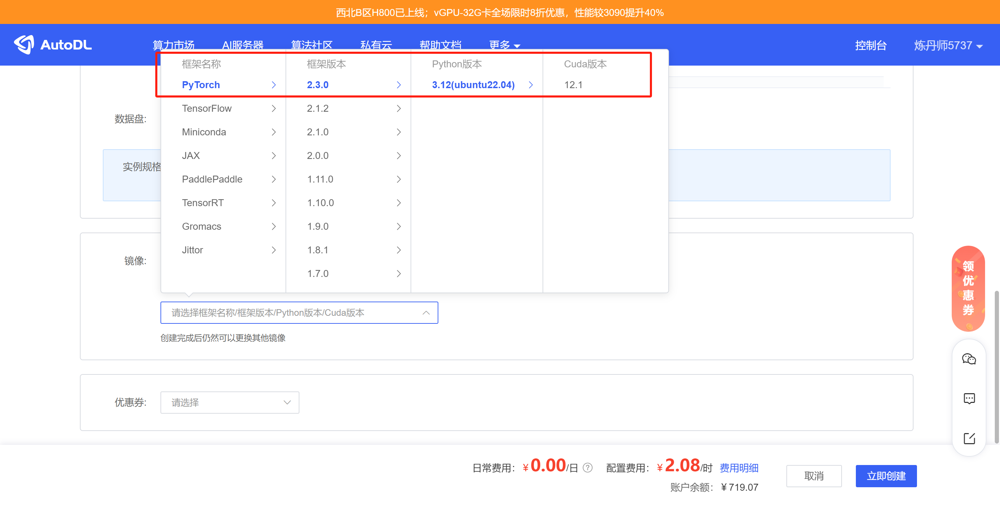

# 地铁清分系统-LLMs
清分系统知识库+LoRA+RAG技术，进行大模型应用的全栈开发

## 首先，进入AutoDL

 

## 然后，按照pytorch2.3.0-gpu-py310-cu121-ubuntu22.04选择镜像

 

## 创建实例

 

## 进入jupyter lab

 

## 新建终端

 

## 在终端中输入命令，准备安装依赖
'''
cat requirements.txt | xargs -n 1 pip install
'''

 

## 上传文件
文件全部来自本仓库的project文件夹

 

## 如图所示，这些文件已被上传

 

## 重启kernel，清理内存
推荐先运行
清分智答RAG
再运行
清分智答LoRA
最后运行
RAG+LoRA

 

